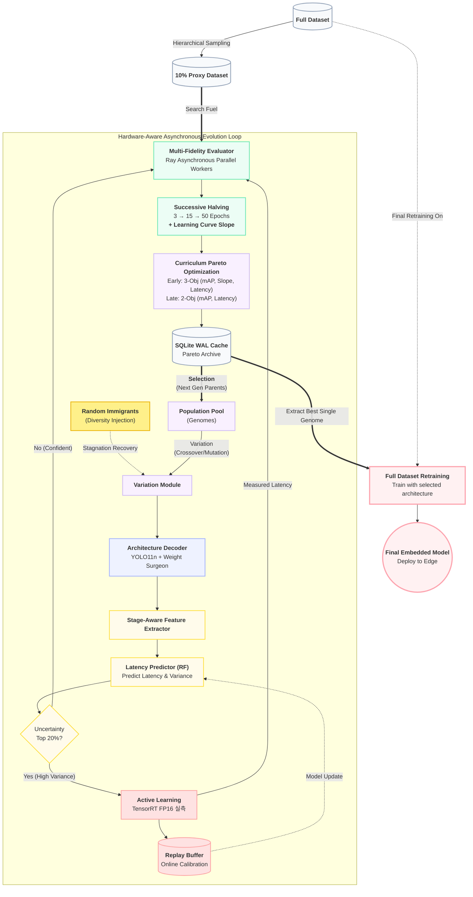

```mermaid
flowchart TD
    %% 스타일 정의
    classDef data fill:#f8fafc,stroke:#94a3b8,stroke-width:2px;
    classDef engine fill:#f9f0ff,stroke:#d0bdf4,stroke-width:2px;
    classDef process fill:#eef2ff,stroke:#a5b4fc,stroke-width:2px;
    classDef predictor fill:#fffbeb,stroke:#fde047,stroke-width:2px;
    classDef trt fill:#fee2e2,stroke:#fca5a5,stroke-width:2px;
    classDef eval fill:#ecfdf5,stroke:#6ee7b7,stroke-width:2px;
    classDef final fill:#fff1f2,stroke:#fda4af,stroke-width:3px;
    classDef highlight fill:#fef08a,stroke:#eab308,stroke-width:2px;

    %% 1. 데이터 준비 (분리)
    D1[("<b>Full Dataset</b>")]:::data -->|"Hierarchical Sampling"| D2[("<b>10% Proxy Dataset</b>")]:::data

    %% 2. 닫힌 NAS 탐색 루프
    subgraph NAS_Loop ["Hardware-Aware Asynchronous Evolution Loop"]
        direction TB
        
        A["<b>Population Pool</b><br>(Genomes)"]:::engine
        
        %% Immigrant Injection 분리 강조 (Novelty 방어)
        A_Imm["<b>Random Immigrants</b><br>(Diversity Injection)"]:::highlight -.->|"Stagnation Recovery"| A_Var
        
        A -->|"Variation<br>(Crossover/Mutation)"| A_Var["<b>Variation Module</b>"]:::engine
        A_Var --> B["<b>Architecture Decoder</b><br>YOLO11n + Weight Surgeon"]:::process
        
        %% HW-Aware Modeling
        B --> C["<b>Stage-Aware Feature Extractor</b>"]:::predictor
        C --> D["<b>Latency Predictor (RF)</b><br>Predict Latency & Variance"]:::predictor
        D --> E{"Uncertainty<br>Top 20%?"}:::predictor
        
        E -->|"Yes (High Variance)"| F["<b>Active Learning</b><br>TensorRT FP16 실측"]:::trt
        F --> G[("<b>Replay Buffer</b><br>Online Calibration")]:::trt
        G -.->|"Model Update"| D
        
        %% Evaluator & Proxy Data Integration (Slope 추가 & Parallel 강조)
        E -->|"No (Confident)"| H["<b>Multi-Fidelity Evaluator</b><br>Ray Asynchronous Parallel Workers"]:::eval
        F -->|"Measured Latency"| H
        
        H --> I["<b>Successive Halving</b><br>3 → 15 → 50 Epochs<br><b>+ Learning Curve Slope</b>"]:::eval
        
        %% Curriculum & Feedback Loop
        I --> J["<b>Curriculum Pareto Optimization</b><br>Early: 3-Obj (mAP, Slope, Latency)<br>Late: 2-Obj (mAP, Latency)"]:::engine
        J --> K[("<b>SQLite WAL Cache</b><br>Pareto Archive")]:::data
        
        K ==>|"<b>Selection</b><br>(Next Gen Parents)"| A
    end

    %% 데이터 결합 (Proxy 데이터가 루프 내부로 직접 꽂힘)
    D2 ===>|"Search Fuel"| H
    
    %% 3. 최종 출력
    D1 -.->|"Final Retraining On"| M
    K ===>|"Extract Best Single Genome"| M["<b>Full Dataset Retraining</b><br>Train with selected architecture"]:::final
    M --> N(("<b>Final Embedded Model</b><br>Deploy to Edge")):::final
```
